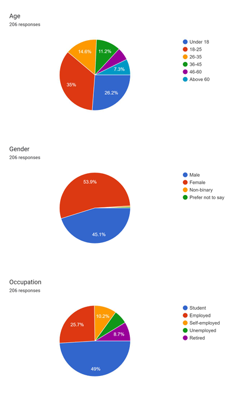
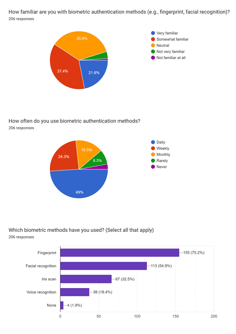
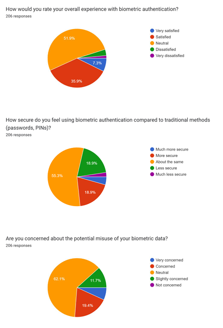
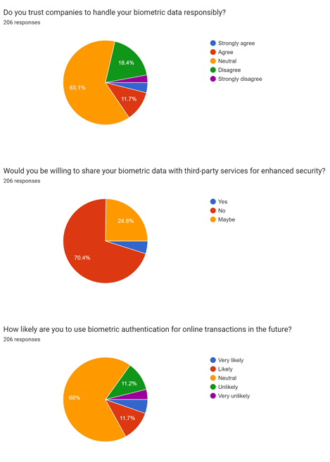
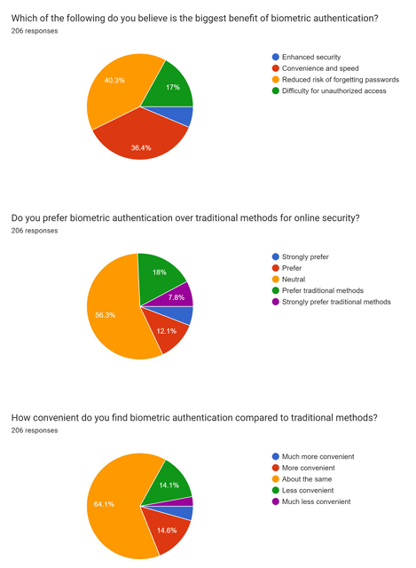
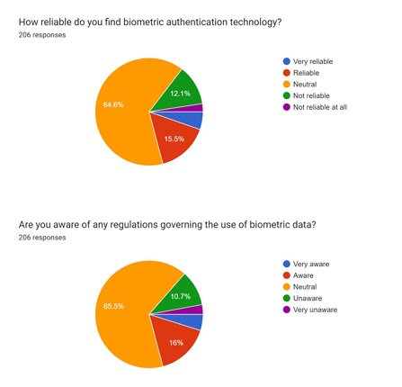

# Attitudes Towards Biometric Authentication for Online Security

This project explores how individuals perceive and interact with biometric authentication methods—such as fingerprint, facial recognition, voice ID, and iris scans—in the context of online security. It aims to evaluate trust, usability, awareness, and concerns around biometric technologies through direct user feedback.

Primary data was collected through a structured Google Form survey, and the responses were analyzed using Python to uncover meaningful patterns and insights. This repository documents the entire process including the raw dataset, analysis script, and visual summaries of response data.

---

## 📁 Project Structure

| File/Folder                             | Description                                                                 |
|----------------------------------------|-----------------------------------------------------------------------------|
| `Biometric Authentication (Responses).csv` | Raw data collected from survey participants                                |
| `biometric_data_insights.py`           | Python script that performs data preprocessing, analysis, and visualization |
| `requirements.txt`                     | List of required Python packages                                            |
| `Responses/`                           | Folder containing PNG images summarizing Google Form responses              |

---

## Objectives

- Understand public awareness of biometric authentication methods.
- Explore user experiences, preferences, and perceived security.
- Identify patterns in demographic data regarding trust and adoption.
- Visualize results to enhance interpretation and reporting.

---

## Data Analysis & Visualization

The Python script (`biometric_data_insights.py`) performs the following:

- Loads and preprocesses the raw CSV data.
- Handles missing values and converts ranges to numerical values.
- Generates count plots, histograms, correlation matrices, boxplots, and scatter plots.
- Performs categorical cross-tabulation and trend analysis.
- Saves cleaned data for further use or reporting.

---

##  Visual Summary of Survey Responses

The following infographics are based on Google Form summary visualizations. Each image provides a snapshot of key sections of the form results.

###  Image 1: Age, Gender, Occupation
This visualization displays the demographic breakdown of respondents. It shows how age groups, gender identities, and professional roles are distributed among participants.



---

###  Image 2: Familiarity and Usage of Biometric Methods
Respondents’ familiarity, usage frequency, and types of biometric methods used (e.g., fingerprint, facial recognition) are represented here. It gives insight into public exposure and preferences.



---

###  Image 3: Experience, Security Perception, and Concerns
This chart explores users' experiences with biometric authentication, their perception of security compared to traditional methods, and concerns regarding data misuse.



---

###  Image 4: Trust, Willingness, and Future Use
This section visualizes respondents’ trust in service providers handling biometric data, their willingness to share data with third parties, and openness to future use.



---

###  Image 5: Benefits, Preference, and Convenience
It shows which benefits (speed, security, ease) users value most, their preferences over traditional security methods, and how convenient they find biometric authentication.



---

###  Image 6: Reliability and Awareness of Regulations
This chart illustrates how reliable respondents perceive biometric authentication to be and their awareness of data protection regulations related to biometric usage.



---

##  How to Run the Analysis

1. **Clone the repository:**
   ```bash
   git clone https://github.com/Shreyabagal/Attitudes-Towards-Biometric-Authentication-for-Online-Security.git
   cd Attitudes-Towards-Biometric-Authentication-for-Online-Security
   ```

2. **Install dependencies:**
   ```bash
   pip install -r requirements.txt
   ```

3. **Run the analysis script:**
   ```bash
   python biometric_data_insights.py
   ```

The script will read the survey data from the CSV file, generate visual insights, and display them using matplotlib and seaborn.

---

##  Contributor

**Shreya Ramchandra Bagal** – Conducted the survey, collected and curated the data, and developed the complete analysis pipeline for this project.

---
